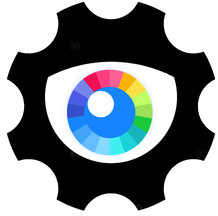

  

# Machine Learning Color Contrast Picker
Get the perfect color contrast using machine learning

1. We set the background of the page to the value of the input
2. We convert the hexadecimal color to rgb
3. Pass the color to the neural network and compute the result
4. Set the text color to the result of the computation

### Input
- The input consists of three entries representing the red, green and blue values of a color. These values are between 0 and 1 because that is what, in this case, the library will accept. To make the original values from a rgb color to these we simply divide them by 255 and we get the number we want.
### Output
- The output is what the text should look like given the input before.

## License

- **[MIT license](http://opensource.org/licenses/mit-license.php)**
- Copyright 2020 © <a href="https://tylerthompson.me" target="_blank">Tyler Thompson</a>
